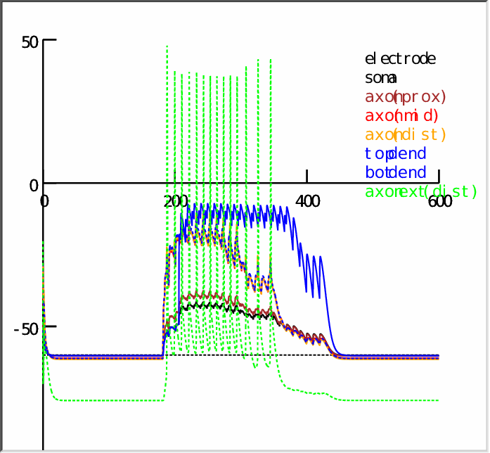
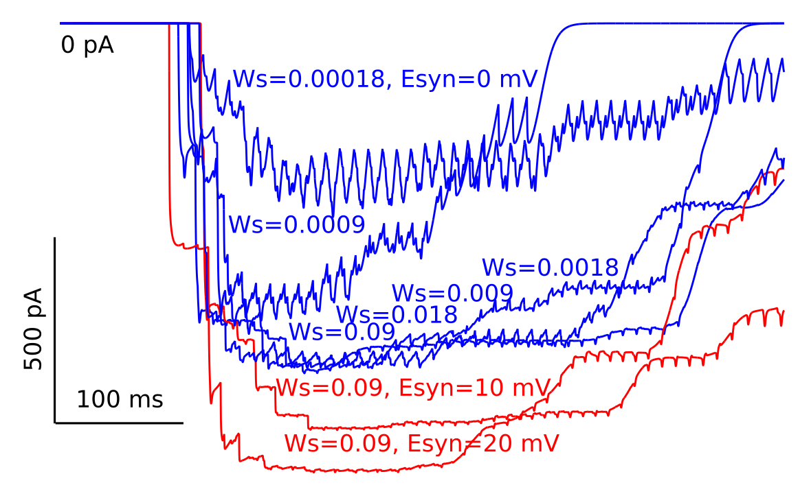
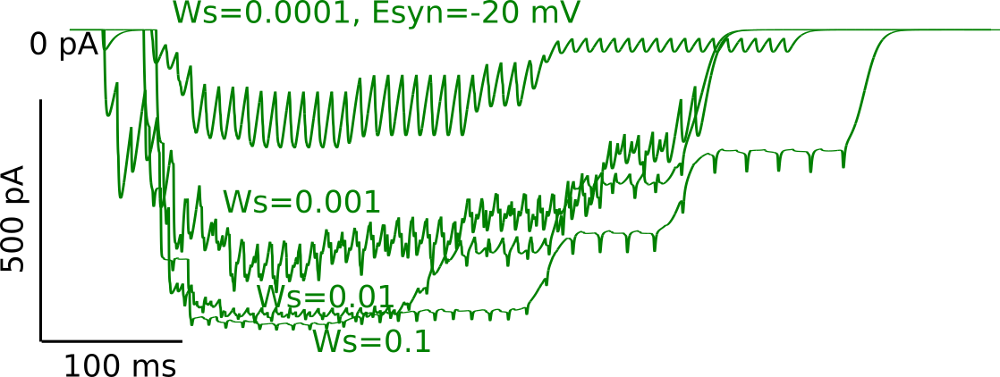

# Saturating synapses with stimulus

This tutorial demonstrates that simulus resulting in Spontaneous
Rhymthmic Currents (SRCs) can cause voltage saturation locally at
synaptic input sites. Synaptic stimuli can be adjusted to increase SRC
amplitude, until voltage at synapses saturate at the synaptic
coductance reversal potential, which limits the SRC amplitude.

You should have [NEURON](https://www.neuron.yale.edu/neuron/download)
and [Python](https://www.python.org/downloads/) installed before
proceeding. See [prereqs](../README.md). Also see [tutorial on running Python with Neuron](../tutorial-python-neuron/README.md) 
for detailed instructions.

## Running the simulation experiment file

Main experiment file for this tutorial is the Python script 
`exp-axon-tail2-chans-ext-axon-70um-10x-mimic-sustained-random.py`. You
can run this in IDLE or `ipython -i` to get an interactive prompt
after it loads. Note that this is not headless simulation and it will
pop up the NEURON GUI, which you will need to manipulate values and
generate graphs.

## Simulation setup

When the experiment file is run, it will set up 10 pre-determined,
random synaptic locations. It will then display the parameters used
for the simulation:

```
$ ipython -i exp-axon-tail2-chans-ext-axon-70um-10x-mimic-sustained-random.py 
Python 3.9.7 (default, Oct 10 2021, 15:13:22) 
Type 'copyright', 'credits' or 'license' for more information
IPython 7.29.0 -- An enhanced Interactive Python. Type '?' for help.
NEURON: unable to open font "*helvetica-medium-r-normal*--14*", using "fixed"
        0 
        0 
        0 
        0 
        0 
        1 
        1 
        1 
Secname L (um)  Diam (um)       Area [um^2]     Ri [MO]         Cm [pF] g_pas [nS]
axon:   37.61   1.14    134.11  35.12   1.34    0.00
soma:   6.98    5.50    120.56  0.28    1.21    0.00
bottom dend:    996.91  0.78    2430.62 1991.49 24.31   0.02
botdend - axon: 959.10  0.76    2292.50 1993.51 22.92   0.02
topdend:        366.00  0.73    837.85  829.37  8.38    0.01
ext. axon:      570.00  0.71    1275.49 1351.81 12.75   1.53
        1 
        1 
        1 
Warning: state file does not exist.
dendrite[685]

dendrite[524]

dendrite[520]

dendrite[626]

dendrite[205]

dendrite[357]

dendrite[464]

dendrite[588]

dendrite[513]

dendrite[48]

Setting: weight=0.00018, tau=5, interval=10, magepsc=20, syne=0
```

After the ipython loading information, the morphology statistics are
displayed, followed by the locations of the 10 synapses. The default
parameters of synaptic stimulation are listed in the final line.

It should also pop up two graphs that you can set "view = plot" from
the right-click menu to see the complete responses. The graph titled
"VClamp[0].i" displays the voltage clamp current. We will be mainly
using this graph to show the saturation effect.

The other graph (below) that has labels for electrode, soma, etc,
shows voltage responses throughout different locations in the
cell. X-axis is time in ms and y-axis voltage in mV. Notice that
voltage clamp of -60 mV is only limited to the black-colored electrode
compartment, and even the soma has escaped the clamp
slightly. Supporting the main argument of this tutorial, blue-colored
dendritic voltage traces escape a large amount and rise up close to
the cholinergic synapses' reversal potential of 0 mV.



## Changing parameters

At the interactive prompt after loading the file (see above on how to
get this), you can rerun the parameter script to change the defaults:

```python
In [1]: set_syn_pars(weight=0.09)
Setting: weight=0.09, tau=5, interval=10, magepsc=20, syne=0
```

After this, one needs to re-initialize and run the simulation for
about 600 ms. You can open the Tools->Runcontrol to do this, or re-run
the last two lines of the experiment script:

```python
h.finitialize(-65 * mV)
h.continuerun(600 * ms)
```

## Spontaneous Rhythmic Current (SRC) amplitude saturation

This simulation aims to mimic the SRC shape by applying a high rate of
firing at the 10 pre-selected synaptic locations. Because the
cholinergic synapses' reversal potential is 0 mV, too much stimulation
causes the voltage escaping from clamp at locations distal to the soma
reach the reversal potential. Once voltage reaches reversal, it
cannot increase further and thus the amplitude of the total SRC no
longer increases with further increasing synaptic input magnitude.

The following graph shows that, only by increasing the synaptic
reversal (Esyn) (red traces), one can further increase SRC amplitude.



## Can reversal potential manipulation expose saturation in increased-stimulus conditions?

To experimentally test the model prediction that saturation is the
reason for lack of observed increases in SRC amplitude, one can
attempt to manipulate reversal potentials in the living cell. To test
whether this manipulation can expose the saturation mechanism, we
changed the synaptic reversal to -20 mV and reran the simulation by
increasing synaptic weights logarithmically as before using the
following code snippet:

```python
import numpy as np

w_min = 0.0001
w_max = 0.1
num_steps = 4

for w in np.logspace(np.log10(w_min), np.log10(w_max), num_steps):
    set_syn_pars(weight=w, syne=-20)
    h.finitialize(-65 * mV)
    h.continuerun(800 * ms)
```

As a result, we obtained smaller SRCs, at about half of the original size:



However, these SRCs also saturate at this amplitude. Therefore, in an
elevated excitability setting, we would expect them to remain the same
size. Therefore, lowering the driving force by reducing the reversal
potential may not be the best strategy for testing the model
prediction experimentally.

Notice that the duration of the SRCs increase as saturation is
reached - similar to experimental observations in SRC duration.

## Exposing saturation by partial block of synaptic conductance

If the synaptic weight is reduced by half, but reversal is kept at its
original value of 0 mV, we get:


As seen in figure above, halving the synaptic weights did not significantly
reduce the amplitude of the SRC - especially if the SRC is already at
a saturation point. Since we don't observe SRC amplitude increases
experimentally, that must be due to being already at saturation. To
see any increase in SRC amplitude, one would need to reduce synaptic
strength by at least an order of magnitude (i.e., divide by 10 or
reduce to 10% of original) according to predictions from the model
simulations.
